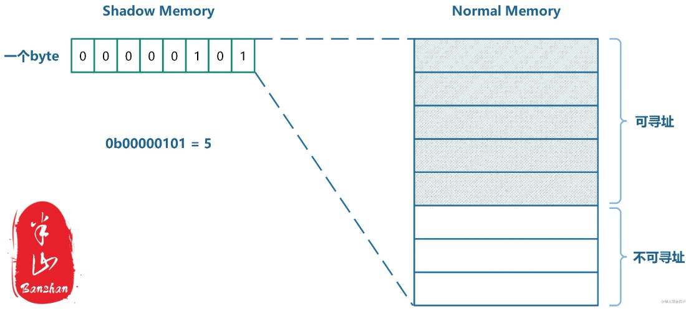
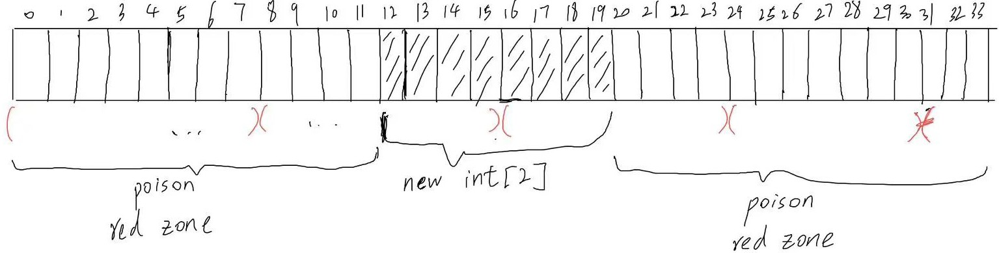
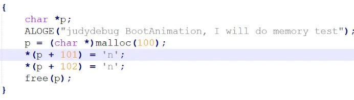

- [ASan](#asan)
  - [可检测的内存问题](#可检测的内存问题)
  - [原理简介](#原理简介)
    - [影子内存](#影子内存)
    - [投毒](#投毒)
  - [ASan](#asan-1)
    - [Asan实现](#asan实现)
    - [ASan检测问题实例](#asan检测问题实例)
  - [问题](#问题)
- [HWASan](#hwasan)
  - [典型错误](#典型错误)
    - [Use After Free](#use-after-free)
    - [Heap Overflow](#heap-overflow)
  - [优缺点](#优缺点)
- [总结](#总结)

# Asan
## 可检测的内存问题：
**ASan 可以比较好的处理这些问题, 同时不至于损失太多性能/空间.**
1. Use after free (dangling pointer dereference)：堆上分配的空间被 free 之后再次使用(指针解引用)
2. Heap buffer overflow：访问的区域在堆上, 并且超过了分配的空间
3. Stack buffer overflow：访问的区域在栈上, 并且超过了分配给它的空间
4. Global buffer overflow：访问的区域是全局变量, 并且超过了分配给它的空间
5. Use after return：默认不开启, 指: 函数在栈上的局部变量在函数返回后被使用
6. Use after scope：局部变量离开作用域以后继续使用
7. Initialization order bugs：默认不开启. 检查全局变量或静态变量初始化的时候有没有利用未初始化的变量
8. Memory leaks：程序结束时未释放堆上分配的内存

**Stack Buffer Overflow**
```
#include <stdio.h>

void vulnerable_function(char* input) {
  char buffer[10];
  strcpy(buffer, input);
  printf("%s\n", buffer);
}

int main(int argc, char** argv) {
  vulnerable_function(argv[1]);
  return 0;
}
```
**Heap Buffer Overflow**
```
#include <stdio.h>
#include <stdlib.h>
#include <string.h>

void vulnerable_function(char* input) {
  char *buffer = (char*) malloc(10);
  strcpy(buffer, input);
  printf("%s\n", buffer);
  free(buffer);
}

int main(int argc, char** argv) {
  vulnerable_function(argv[1]);
  return 0;
}
```
**Global Buffer Overflow**
```
#include <stdio.h>
#include <string.h>

char buffer[10];

void vulnerable_function(char* input) {
  strcpy(buffer, input);
  printf("%s\n", buffer);
}

int main(int argc, char** argv) {
  vulnerable_function(argv[1]);
  return 0;
}
```
**Use After Return**
```
#include <stdio.h>
#include <string.h>

char *create_string(char *input) {
  char buffer[10];
  strcpy(buffer, input);
  return buffer;
}

int main(int argc, char** argv) {
  char *returned_ptr = create_string(argv[1]);
  printf("%s\n", returned_ptr);
  return 0;
}
```
the buffer is stored on the stack and is automatically freed when the function returns. If the pointer returned_ptr is used after the function returns, it will point to memory that has already been freed  
**Initialization Order Bugs**
```
#include <iostream>

class A {
public:
  A() {
    std::cout << "A constructor" << std::endl;
  }
};

class B {
public:
  B() {
    std::cout << "B constructor" << std::endl;
  }
  A a;
};

class C {
public:
  C() {
    std::cout << "C constructor" << std::endl;
  }
  B b;
};

int main() {
  C c;
  return 0;
}
```
**Memory Leaks**
```
#include <stdio.h>
#include <stdlib.h>

void memory_leak() {
  char *buffer = (char*) malloc(10);
  // No free statement to release the memory
}

int main() {
  while (true) {
    memory_leak();
  }
  return 0;
}
```
Didnt free buffer

## 原理简介
接管每次内存分配/释放。 并且每一次对内存的读/写都需要加上一个检查 (所以需要编译器的配合)。
### 影子内存
用户程序所在的内存区域叫做主内存, 而记录主内存可用性的内存区域, 则叫做影子内存 (Shadow memory)。影子内存是指由程序保留或分配但未被该程序使用或访问的内存。  
Malloc函数返回的地址通常是8字节对齐的，因此任意一个由（对齐的）8字节所组成的内存区域必然落在以下几种状态之中：最前面的k（0≤k≤8）字节是可寻址的，而剩下的8-k字节是不可寻址的。这几种状态便可以用shadow memory中的一个字节来进行编码。一个byte可以编码的状态总共有256（2^8）种。  
**shadow mem映射到normal mem:**  

**根据normal memory的地址找到它对应的shadow memory:**  
Shadow memory address = (Normal memory address >> 3) + 0x1000000000 (9个0)  
右移三位的目的是为了完成 8➡1的映射，而加一个offset是为了和Normal memory区分开来。最终内存空间种会存在如下的映射关系：  
1. 8字节组成的memory region共有9中状态：
- 1~7个字节可寻址（共七种），shadow memory的值为1~7。
- 8个字节都可寻址，shadow memory的值为0。
- 0个字节可寻址，shadow memory的值为负数。
2. 为什么0个字节可寻址的情况shadow memory不为0，而是负数。因为0个字节可寻址其实可以继续分为多种情况
- 这块区域是heap redzones
- 这块区域是stack redzones
- 这块区域是global redzones
- 这块区域是freed memory
对所有0个字节可寻址的normal memory region的访问都是非法的，ASAN将会报错。而根据其shadow memory的值便可以具体判断是哪一种错。
```
Shadow byte legend (one shadow byte represents 8 application bytes):
  Addressable:           00
  Partially addressable: 01 02 03 04 05 06 07 
  Heap left redzone:     fa (实际上Heap right redzone也是fa)
  Freed Heap region:     fd
  Stack left redzone:    f1
  Stack mid redzone:     f2
  Stack right redzone:   f3
  Stack after return:    f5
  Stack use after scope: f8
  Global redzone:        f9
  Global init order:     f6
  Poisoned by user:      f7
  Container overflow:    fc
  Array cookie:          ac
  Intra object redzone:  bb
  ASan internal:         fe
  Left alloca redzone:   ca
  Right alloca redzone:  cb
  Shadow gap:            cc
```

**影子内存包含**
1. 段描述符：定义内存段属性的数据结构，例如其大小、位置和访问权限。
2. Canaries：放置在内存中缓冲区前后的值。如果发生缓冲区溢出，金丝雀将被覆盖，允许程序检测并防止缓冲区溢出漏洞的利用。
3. Shadow Stack：影子栈是一种用于存储函数调用返回地址的数据结构。它可用于检测和防止基于堆栈的缓冲区溢出和其他类型的操纵调用堆栈的攻击。
4. Metadata：元数据是提供有关其他数据的信息的数据。影子内存可用于存储有关内存区域的元数据，例如区域的大小、区域的访问权限以及区域的状态（例如，是否已分配或释放）。
5. Red zones：红色区域是在堆栈分配的缓冲区之前和之后保留的内存区域。如果发生缓冲区溢出，溢出不会覆盖红色区域，允许程序检测溢出并防止其被利用。
6. Guard pages：保护页是在内存区域之间保留的内存区域。如果程序试图访问保护页中的内存，将导致分段错误，从而使操作系统能够检测并防止内存相关漏洞的利用。

每一次内存的分配和释放, 都会写入影子内存。每次读/写内存区域前, 都会读取一下影子内存, 获得这块内存访问合法性 (是否被分配, 是否已被释放)。  

_堆从内存高地址增长到内存低地址，而栈从内存低地址增长到内存高地址。这样，堆和栈就不会互相覆盖，堆的内存分配和函数调用栈的处理可以独立完成。
堆栈分别在虚拟内存地址空间的两端, 这样影子内存就会落在中间. 而如果用户以外访问了影子内存, 就可以知道访问出了些问题。_

### 投毒
为了禁止使用某些内存地址, 我们可以在影子内存里下毒 (poisoning)。 影子内存里面每个 byte, 都记录了其对应的 8byte 内存的下毒情况. 由于我们要求内存分配是按照 8 字节对齐的, 所以主内存里面如果有毒, 一定是前面连续 k 字节无毒, 后面连续 8 - k 字节有毒. 这个就会记录在影子内存里。  
_N字节对齐是指为数据分配的内存地址必须能被N整除。换句话说，一个内存块的起始地址必须是8的倍数。_  
**具体功能实现（可检测到的内存问题）：**
1. Use after free (dangling pointer dereference)  
free 掉的区域马上变成有毒的即可. 当然, 过了一段时间可以给它解毒。  
-- 他会持有一段 FIFO 的有毒内存队列, 默认大小是 256 MB. 所以如果你 Use after free 在 256 MB 新的分配之后, 也有可能检测不出来。  
2. Buffer overflow  
包括堆内存越界，栈内存越界，全局变量越界
在每一个对象前后下毒. 只要超出了访问区域就会遇到下毒的区域, 叫做红区(red zone). 红区的长度很有可能至少是 32 字节(对应四个影子内存的 byte), 并且保持 32 字节对齐。  
-- 由于具有 1:8 的压缩比, 并且是按照 8 字节对齐的, 如果访问的内存区域未对齐, 则有可能检测不出越界访问。例如:
```
int *x = new int[2];           // 8 bytes: [0,7].
int *u = (int*)((char*)x + 6);
*u = 1;                        // Access to range [6-9]
```

3. Use After Scope/Return  
进入局部作用域就把对应内存下毒即可。由于默认情况下不检测 use after return, 所以可以在 return 的时候就对这段内存解毒。  
在默认情况下不检测use after return是因为它很难被检测到。在使用返回值后马上回收该内存, 可能还没有被其他代码修改。因此, 无法确定当前内存是否还有效。即使使用内存安全工具如检测内存越界, 也不能100%保证正确性。此外, 这种错误的检测需要额外的代码支持, 可能会增加程序的复杂性。  
4. Memory Leaks  
程序结束时检测堆上未释放的内存, 报个错. 这个实现起来并不复杂. 还可以检测出二次释放等问题。  
因为我们在堆上分配了 red zone, 这些 red zone 也可以利用起来, 写入一些调试信息在里面. 这样可以知道啥地方出了问题。  

## ASan
_HWASAN则是ASAN的升级版，它利用了64位机器上忽略高位地址的特性，将这些被忽略的高位地址重新利用起来，从而大大降低了工具对于CPU和内存带来的额外负载。_  
ASAN 接管了应用程序的 malloc 流程，每次分配内存，一定使用全新的虚拟地址，并且在地址两端加页保护。因为虚拟内存资源是“无限”的，所以可以大量浪费：
1. 分配过的地址空间，即使 free 过了，也不会再次分配给用户。用户感受到的就是内存分配器每次分配出来的内存地址总是比上一次的高。（已经 free 过的内存区域这里称为 Dead Zone）  
2. 每次分配一段内存时，总会在两端预留一个页面，并且将这两个页面做读写保护。（两端预留的页面称为 Red Zone）
### ASan实现
**ASAN工具主要由两部分组成：**  
1. 编译器插桩模块  
- 加了ASAN相关的编译选项后，代码中的每一次内存访问操作都会被编译器修改为如下方式  
```
前:
*address = ...;  // or: ... = *address;
```
```
后:
if (IsPoisoned(address)) {
  ReportError(address, kAccessSize, kIsWrite);
}
*address = ...;  // or: ... = *address;
```
关键点就在于读写内存前会判断地址是否处于“中毒”状态，即检查该内存所对应的shadow memory的状态。还有如何把IsPoisoned实现的非常快，把ReportError实现的非常紧凑，从而避免插入的代码过多。这是静态插桩，因此需要重新编译。   
IsPoisoned的key code:
```
ShadowAddr = (Addr >> 3) + Offset;            //Mem 映射到 Shadow Mem
k = *ShadowAddr;                              //取出其中存取的byte值，可寻址byte
if (k != 0 && ((Addr & 7) + AccessSize > k))
	ReportAndCrash(Addr);
//k!=0，说明Normal memory region中的8个字节并不是都可以被寻址的。
//Addr & 7，将得知此次内存访问是从memory region的第几个byte开始的。
//AccessSize是此次内存访问需要访问的字节长度。
//(Addr&7)+AccessSize > k，则说明此次内存访问将会访问到不可寻址的字节。（具体可分为k大于0和小于0两种情况来分析）
//ASAN会报错并结合shadow memory中具体的值明确错误类型。
```
- 为所有**栈上对象和全局对象**创建前后的保护区(Poisoned redzone)，为检测溢出做准备。  
2. 运行时库  
- （libasan.so.x）替换默认路径的malloc/free等函数。为所有堆对象创建前后的保护区，将free掉的堆区域隔离(quarantine)(也就是暂时被标记为中毒状态)一段时间，避免它立即被分配给其他人使用。  
- 对错误情况进行输出，包括堆栈信息。  

asan 提供的 malloc 实现:  
```
// asan提供的malloc函数
void* asan_malloc(size_t requested_size) {
    size_t actual_size = RED_ZONE_SIZE /*前redzone*/ + align8(requested_size) + RED_ZONE_SIZE/*后redzone*/;
    // 调用libc的malloc去真正的分配内存
    char* p = (char*)libc_malloc(acutal_size);
    // 标记前后redzone区不可读写
    poison(p, requested_size);

    return p + RED_ZONE_SIZE; // 返回偏移后的地址
}

void foo() {
  // 运行时实际执行的代码
  char* ptr = asan_malloc(10);

  // 编译器插入的代码
  if (isPoisoned(ptr+1)) {
    abort();
  }
  ptr[1] = 'a';

  // 编译器插入的代码
  if (isPoisoned(ptr+10)) {
    abort(); // crash：访问到了redzone区域
  }
  ptr[10] = '\n'
}
```
asan 提供的堆上变量的越界访问检测实现:  
```
void foo() 
{  
  char a[8];  
  a[1] = '\0';  
  a[8] = '\0'; // 越界  
  return;
}
```

```
void foo() 
{  
  char redzone1[32];  // 编译器插入的代码, 32字节对齐  
  char a[8];  
  char redzone2[24];  // 编译器插入的代码, 与用于申请的数组a一起做32字节对齐  
  char redzone3[32];  // 编译器插入的代码, 32字节对齐  
  
  // 编译器插入的代码  
  int  *shadow_base = MemToShadow(redzone1);  
  shadow_base[0] = 0xffffffff;  // 标记redzone1的32个字节都不可读写  
  shadow_base[1] = 0xffffff00;  // 标记数组a的8个字节为可读写的，而redzone2的24个字节均不可读写  
  shadow_base[2] = 0xffffffff;  // 标记redzone3的32个字节都不可读写  
  
  // 编译器插入的代码  
  if (isPoisoned(a+1)) 
  {      
    abort();  
  }  
  a[1] = '0';  
  
  // 编译器插入的代码  
  if (isPoisoned(a+8)) 
  {      
    abort(); // crash: 因为a[8]访问到了redzone区  
  }
  a[8] = '\0';  
  
  // 整个栈帧都要被回收了，所以要将redzone和数组a对应的内存都标记成可读可写的  
  shadow_base[0] = shadow_base[1] = shadow_base[2] = 0;  
  return;
}
```

**Asan对缓冲区溢出防护的的基本步骤**  
1. 通过在被保护的栈、全局变量、堆周围建立标记为中毒状态(Poisnoned)的red-zones
2. 将缓冲区和red-zone通过每8字节对应1字节的映射的方式建立影子内存区，影子内存区的获取函数为MemToShadow
3. 如果出现对red-zone的读、写或执行的访问，则ASan可以ShadowIsPoisoned检测出来并报错。报错信息给出出错的源文件名、行号、函数调用关系、影子内存状态。其中影子内存状态信息中出错的部分用中括号标识出来。

### ASan检测问题实例
- Use-After-Free
想要检测UseAfterFree的错误，需要有两点保证：  
  1. 已经free掉的内存区域需要被标记成特殊的状态。在ASAN的实现里，free掉的normal memory对应的shadow memory值为0xfd（猜测有freed的意思）。
  2. 已经free掉的内存区域需要放入隔离区一段时间，防止发生错误时该区域已经通过malloc重新分配给其他人使用。一旦分配给其他人使用，则可能漏掉UseAfterFree的错误。  
test code
```
// RUN: clang -O -g -fsanitize=address %t && ./a.out
int main(int argc, char **argv) {
  int *array = new int[100];
  delete [] array;
  return array[argc];  // BOOM
}
```
ASAN输出的错误信息：
```
=================================================================
==6254== ERROR: AddressSanitizer: heap-use-after-free on address 0x603e0001fc64 at pc 0x417f6a bp 0x7fff626b3250 sp 0x7fff626b3248
READ of size 4 at 0x603e0001fc64 thread T0
    #0 0x417f69 in main example_UseAfterFree.cc:5
    #1 0x7fae62b5076c (/lib/x86_64-linux-gnu/libc.so.6+0x2176c)
    #2 0x417e54 (a.out+0x417e54)
0x603e0001fc64 is located 4 bytes inside of 400-byte region [0x603e0001fc60,0x603e0001fdf0)
freed by thread T0 here:
    #0 0x40d4d2 in operator delete[](void*) /home/kcc/llvm/projects/compiler-rt/lib/asan/asan_new_delete.cc:61
    #1 0x417f2e in main example_UseAfterFree.cc:4
previously allocated by thread T0 here:
    #0 0x40d312 in operator new[](unsigned long) /home/kcc/llvm/projects/compiler-rt/lib/asan/asan_new_delete.cc:46
    #1 0x417f1e in main example_UseAfterFree.cc:3
Shadow bytes around the buggy address:
  0x1c07c0003f30: fa fa fa fa fa fa fa fa fa fa fa fa fa fa fa fa
  0x1c07c0003f40: fa fa fa fa fa fa fa fa fa fa fa fa fa fa fa fa
  0x1c07c0003f50: fa fa fa fa fa fa fa fa fa fa fa fa fa fa fa fa
  0x1c07c0003f60: fa fa fa fa fa fa fa fa fa fa fa fa fa fa fa fa
  0x1c07c0003f70: fa fa fa fa fa fa fa fa fa fa fa fa fa fa fa fa
=>0x1c07c0003f80: fa fa fa fa fa fa fa fa fa fa fa fa[fd]fd fd fd
  0x1c07c0003f90: fd fd fd fd fd fd fd fd fd fd fd fd fd fd fd fd
  0x1c07c0003fa0: fd fd fd fd fd fd fd fd fd fd fd fd fd fd fd fd
  0x1c07c0003fb0: fd fd fd fd fd fd fd fd fd fd fd fd fd fd fa fa
  0x1c07c0003fc0: fa fa fa fa fa fa fa fa fa fa fa fa fa fa fa fa
  0x1c07c0003fd0: fa fa fa fa fa fa fa fa fa fa fa fa fa fa fa fa
```
=>指向的那行有一个byte数值用中括号给圈出来了：[fd]。它表示的是此次出错的内存地址对应的shadow memory的值。而其之前的fa表示Heap left redzone，它是之前该区域有效时的遗留产物。连续的fd总共有50个，每一个shadow memory的byte和8个normal memory byte对应，所以可以知道此次free的内存总共是50×8=400bytes。这一点在上面的log中也得到了验证
```
0x603e0001fc64 is located 4 bytes inside of 400-byte region [0x603e0001fc60,0x603e0001fdf0)
//ASAN的log中不仅有出错时的堆栈信息，还有该内存区域之前free时的堆栈信息。
```
- Heap-Buffer-Overflow
检测HeapBufferOverflow的问题，只需要保证一点：
  1. 正常的Heap前后需要插入一定长度的安全区，而且此安全区对应的shadow memory需要被标记为特殊的状态。在ASAN的实现里，安全区被标记为0xfa。  

test code:  

ASAN输出的错误信息：
```
=================================================================
==1405==ERROR: AddressSanitizer: heap-buffer-overflow on address 0x0060bef84165 at pc 0x0058714bfb24 bp 0x007fdff09590 sp 0x007fdff09588
WRITE of size 1 at 0x0060bef84165 thread T0
    #0 0x58714bfb20  (/system/bin/bootanimation+0x8b20)
    #1 0x7b434cd994  (/apex/com.android.runtime/lib64/bionic/libc.so+0x7e994)

0x0060bef84165 is located 1 bytes to the right of 100-byte region [0x0060bef84100,0x0060bef84164)
allocated by thread T0 here:
    #0 0x7b4250a1a4  (/system/lib64/libclang_rt.asan-aarch64-android.so+0xc31a4)
    #1 0x58714bfac8  (/system/bin/bootanimation+0x8ac8)
    #2 0x7b434cd994  (/apex/com.android.runtime/lib64/bionic/libc.so+0x7e994)
    #3 0x58714bb04c  (/system/bin/bootanimation+0x404c)
    #4 0x7b45361b04  (/system/bin/bootanimation+0x54b04)

SUMMARY: AddressSanitizer: heap-buffer-overflow (/system/bin/bootanimation+0x8b20) 
Shadow bytes around the buggy address:
  0x001c17df07d0: fa fa fa fa fa fa fa fa fd fd fd fd fd fd fd fd
  0x001c17df07e0: fd fd fd fd fd fa fa fa fa fa fa fa fa fa fa fa
  0x001c17df07f0: fd fd fd fd fd fd fd fd fd fd fd fd fd fa fa fa
  0x001c17df0800: fa fa fa fa fa fa fa fa fd fd fd fd fd fd fd fd
  0x001c17df0810: fd fd fd fd fd fa fa fa fa fa fa fa fa fa fa fa
=>0x001c17df0820: 00 00 00 00 00 00 00 00 00 00 00 00[04]fa fa fa
  0x001c17df0830: fa fa fa fa fa fa fa fa fa fa fa fa fa fa fa fa
  0x001c17df0840: fa fa fa fa fa fa fa fa fa fa fa fa fa fa fa fa
  0x001c17df0850: fa fa fa fa fa fa fa fa fa fa fa fa fa fa fa fa
  0x001c17df0860: fa fa fa fa fa fa fa fa fa fa fa fa fa fa fa fa
  0x001c17df0870: fa fa fa fa fa fa fa fa fa fa fa fa fa fa fa fa
```
最终出错的shadow memory值为0x4，表示该shadow memroy对应的normal memory中只有前4个bytes是可寻址的。0x4的shadow memory前还有12个0x0，表示其前面的12个memory region（每个region有8个byte）都是完全可寻址的。因此所有可寻址的大小=12×8+4=100，正是代码中malloc的size。  
之所以此次访问会出错，是因为地址0x60bef84165意图访问最后一个region的第五个byte，而该region只有前四个byte可寻址。由于0x4后面是0xfa，因此此次错误属于HeapBufferOverflow。  

## 问题
1. 对于访存越界，如果越界正好跨入了另一个合法内存区域，它就发现不了问题。即ASAN对于overflow的检测依赖于安全区，而安全区总归是有大小的。它可能是64bytes，128bytes或者其他什么值，但不管怎么样终归是有限的。如果某次踩踏跨过了安全区，踩踏到另一片可寻址的内存区域，ASAN同样不会报错。这是ASAN的另一种漏检。  
2. ASAN的运行是需要消耗memory和CPU资源的，此外它也会增加代码大小。它的性能相比于之前的工具确实有了质的提升，但仍然无法适用于某些压力测试场景，尤其是需要全局打开的时候。这一点在Android上尤为明显，每当我们想要全局打开ASAN调试某些奇葩问题时，系统总会因为负载过重而跑不起来。
3. ASAN对于UseAfterFree的检测依赖于隔离区，而隔离时间是非永久的。也就意味着已经free的区域过一段时间后又会重新被分配给其他人。当它被重新分配给其他人后，原先的持有者再次访问此块区域将不会报错。因为这一块区域的shadow memory不再是0xfd。所以这算是ASAN漏检的一种情况。

# HWASan
“升级版”，它基本上解决了上面所说的ASAN的3个问题。但是它需要64位硬件的支持，也就是说在32位的机器上该工具无法运行。  
_AArch64是64位的架构，指的是寄存器的宽度是64位，但并不表示内存的寻址范围是2^64。真实的寻址范围和处理器内部的总线宽度有关，实际上ARMv8寻址只用到了低48位。也就是说，一个64bit的指针值，其中真正用于寻址的只有低48位。_  
AArch64拥有地址标记(Address tagging, or top-byte-ignore)的特性，它表示允许软件使用64bit指针值的高8位开发特定功能。**HWASAN中normal memory和shadow memory的映射关系是16➡1，而ASAN中二者的映射关系是8➡1。**  

----
例子：  
堆内存通过malloc分配出来，HWASAN在它返回地址时会更改该有效地址的高8位。更改的值是一个随机生成的单字节值，譬如0xaf（1010 1111）。此外，该分配出来的内存对应的shadow memory值也设为0xaf。  
## 典型错误
### Use After Free
当一个堆内存被分配出来时，返回给用户空间的地址便已经带上了标签（存储于地址的高8位）。之后通过该地址进行内存访问，将先检测地址中的标签值和访问地址对应的shadow memory的值是否相等。如果相等则验证通过，可以进行正常的内存访问。  
当该内存被free时，HWASAN会为该块区域分配一个新的随机值，存储于其对应的shadow memory中。如果此后再有新的访问，则地址中的标签值必然不等于shadow memory中存储的新的随机值，因此会有错误产生。  
### Heap OverFlow
有一个前提需要满足：相邻的memory区域需要有不同的shadow memory值，否则将无法分辨两个不同的memory区域。  
**错误信息示例**
```
Abort message: '==12528==ERROR: HWAddressSanitizer: tag-mismatch on address 0x003d557e2c20 at pc 0x00748b4a6918
READ of size 4 at 0x003d557e2c20 tags: d1/9b (ptr/mem) in thread T0
    #0 0x748b4a6914  (/system/lib64/libutils.so+0x11914)
    #1 0x748a521bdc  (/apex/com.android.runtime/lib64/bionic/libc.so+0x121bdc)
    #2 0x748a51ad7c  (/apex/com.android.runtime/lib64/bionic/libc.so+0x11ad7c)
    #3 0x748a47f830  (/apex/com.android.runtime/lib64/bionic/libc.so+0x7f830)

[0x003d557e2c20,0x003d557e2c80) is a small unallocated heap chunk; size: 96 offset: 0
Thread: T0 0x006b00002000 stack: [0x007fcd371000,0x007fcdb71000) sz: 8388608 tls: [0x000000000000,0x000000000000)
HWAddressSanitizer can not describe address in more detail.
Memory tags around the buggy address (one tag corresponds to 16 bytes):
   e1  e1  e1  e1  83  83  83  83  83  00  a3  a3  a3  a3  a3  a3   
   b7  b7  b7  b7  b7  00  01  01  01  01  01  00  95  95  95  95   
   95  00  ec  ec  ec  ec  ec  00  c8  c8  c8  c8  c8  00  21  21   
   21  21  21  00  cb  cb  cb  cb  cb  00  b8  b8  b8  b8  b8  00   
   14  14  14  14  14  14  b9  b9  b9  b9  b9  b9  89  89  89  89   
   89  89  95  95  95  95  95  95  47  47  47  47  47  00  fe  fe   
   fe  fe  fe  00  c5  c5  c5  c5  c5  00  8e  8e  8e  8e  8e  8e   
   5c  5c  5c  5c  5c  5c  af  af  af  af  af  af  b0  b0  b0  b0   
=> b0  b0 [9b] 9b  9b  9b  9b  9b  1f  1f  1f  1f  1f  1f  69  69 <=
   69  69  69  a0  7a  7a  7a  7a  7a  ff  eb  eb  eb  eb  eb  eb   
   16  16  16  16  16  16  81  81  81  81  81  81  7f  7f  7f  7f   
   7f  7f  57  57  57  57  57  57  e0  e0  e0  e0  e0  e0  94  94   
   94  94  94  00  35  35  35  35  35  35  98  98  98  98  98  00   
   7d  7d  7d  7d  7d  7d  6e  6e  6e  6e  6e  6e  59  59  59  59   
   59  59  8e  8e  8e  8e  8e  8e  6d  6d  6d  6d  6d  6d  69  69   
   69  69  69  69  d5  d5  d5  d5  d5  d5  63  63  63  63  63  63   
```
0x9b总共有6个，因此该memory区域的总长为6×16=96，与上述提示一致。  
```
[0x003d557e2c20,0x003d557e2c80) is a small unallocated heap chunk; size: 96
```
## 优缺点
和ASAN相比，HWASAN具有如下缺点：
1. 可移植性较差，只适用于64位机器。
2. 需要对Linux Kernel做一些改动以支持工具。
3. 对于所有错误的检测将有一定概率false negative（漏掉一些真实的错误），概率为1/256。原因是tag的生成只能从256（2^8）个数中选一个，因此不同地址的tag将有可能相同。

不过相对于这些缺点，HWASAN所拥有的优点更加引人注目：
1. 不再需要安全区来检测Buffer Overflow，既极大地降低了工具对于内存的消耗，也不会出现ASAN中某些overflow检测不到的情况。
2. 不再需要隔离区来检测Use After Free，因此不会出现ASAN中某些UseAfterFree检测不到的情况。即容易检测野指针

_问题：_  
上述的讨论其实回避了一个问题：如果一个16字节的memory region中只有前几个字节可寻址（假设是5），那么其对应的shadow memory值也是5。这时，如果用地址去访问该region的第2个字节，那么如何判断访问是否合规呢？  
在HWASAN中，当memory region中只有前几个字节可被访问时，该memory region的随机值会被保存在最后一个字节中，以便判断访问是否合规。如果访问的地址的tag和shadow memory的值不等，但是和memory region的最后一个字节相等，说明该访问是合法的。  
shadow memory通常和第一个字节的随机值相同，但是在一些情况下，比如内存不对齐的情况，shadow memory的值就不再是随机的，而是可寻址的字节数。这就可能导致访问的地址的tag和shadow memory的值不等的情况。因此，HWASAN在这种情况下将memory region的随机值保存在最后一个字节中，以确保访问的合法性。  
如果内存不对齐，则说明当前内存块可寻址的字节数小于 16 字节，此时如果仍然使用 shadow memory 存储随机值，则可能与当前内存块实际可寻址的字节数不同，从而导致误判。为了维护内存访问的正确性，HWASAN 在这种情况下将 shadow memory 的值设为实际可寻址的字节数，这样便可以更精确地判断访问是否合法。  

# 总结
**HWASAN 和 ASAN 的前提是都需要内存对齐,不论是在堆上，栈上分配的对象，还是全局对象，他们的内存起始地址都会做对齐（malloc或者编译器来保证）**


