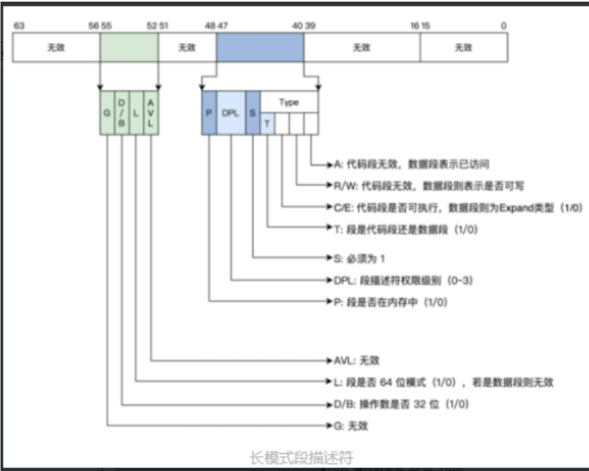
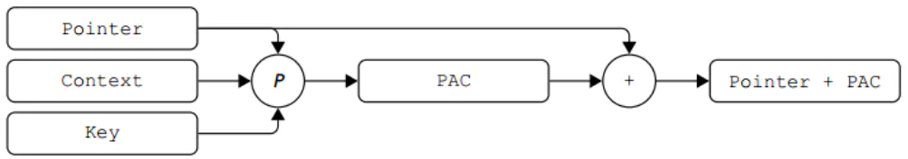
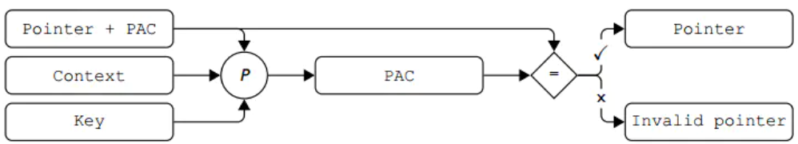

ASAN 
1. AFL中用来感知漏洞的发生。
2. root cause analysis.

# PACMem: Enforcing Spatial and Temporal Memory Safety via ARM Pointer Authentication
- [背景知识](#背景知识)
    - [ARM指针认证](#arm指针认证)
        - [介绍](#介绍)
        - [原理](#原理)
        - [应用](#应用)
    - [现有内存安全解决方案和缺点](#现有内存安全解决方案和缺点)
    - [时空安全和完整的内存安全方案](#时空安全和完整的内存安全方案)
- [PACMem工作](#PACMem工作)
    - [简介](#简介)
    - [具体工作](#具体工作)
        - [构成](#构成)
        - [性能优化](#性能优化)
    - [效果](#效果)
- [我的想法](#我的思考)


# 背景知识
## ARM指针认证
### 介绍
ARM指针认证是针对ARM处理器架构的一种程序认证方式。它确保使用ARM指令集的程序是可信的，并且可以在ARM处理器上安全运行。ARMV8.3-A指令集中加入了指针认证（Pointer Authentication）机制，在使用寄存器的值作为指针访问数据或代码之前验证其内容，目的是为了对抗ROP/JOP攻击和缓冲区溢出攻击。  
**_将攻击地址放到函数返回点(链接地址)来实现攻击。实际上许多漏洞原理都是想方设法让程序(甚至内核)信任攻击者的设置好的内存地址并让程序去访问这个地址来实现攻击。_**  
**_ROP/JOP: 利用漏洞攻击计算机系统的技术。它们通过在内存中重新排列已有代码片段（通常是程序的库函数或操作系统的内置函数），来绕过内存保护机制，从而执行任意代码。_**  
64位的处理器中并不是所有位全都用了。64位的linux使用低48位地址来表示虚拟地址空间，40位地址来表示物理地址和空间，高位地址空间是符号位的扩展。PA利用这一特性，通过特殊指令在寄存器的高位中存入一个验证码（Pointer Authentication Code，PAC），在寄存器内容使用之前进行验证，保证寄存器内容的完整性，并将寄存器中内容恢复原状。  

### 原理
利用特殊指令根据一个**64位的上下文、指针的原始值和一个128位的密钥**通过一个加密算法的运算之后得到一个64位的密文，对其进行截断之后作为PAC  
在使用该指针之前利用特殊指令对指针值进行验证，验证通过之后将指针的高位恢复原状，否则在指针高位填入错误代码，在寻址阶段会触发例外  
密钥可以让攻击者无法生成合法的身份认证，而上下文可以防止攻击者对一些泄露的有效地址指针进行重复利用。  
1. 特殊指令  
PAC*: 生成和向指针值中插入PAC。  
例如，PACIA X3，X4；X3寄存器中是指针的原始值，该指令把X4作为上下文，IA作为密钥，计算PAC，并将PAC添加到指针值中，最后将结果写回X3寄存器中。此时指针的值不可用。
  
AUT*指令，用来验证和从指针值中移除PAC。  
例如，AUTIA X3，X4；X3寄存器中是添加PAC之后的指针值，该指令以X4作为上下文，IA作为密钥再次计算PAC值，并与寄存器中的PAC进行比较，如果计算得到的PAC和寄存器中的PAC是相同的则代表验证通过，把PAC从指针值中去除掉，并将结果写回X3寄存器。    
  
XPAC* 类指令，该指令可以移除一个指针的 PAC 并且在**不验证指针有效性的前提下恢复指针的原始值**。

2. 密钥
PA机制中有五类密钥，指令指针密钥IA、IB，数据指针密钥DA、DB和用于PACGA指令的特殊通用密钥GA。  
密钥是在进程创建时产生的随机值，在进程复制时子进程继承父进程的密钥值，当子进程执行exec()时，得到子进程自己的密钥。这些密钥存储在CPU内部的寄存器中，EL0特权级无法读取该寄存器，EL1特权级的密钥由更高特权级进行管理。   
**_PA支持内核(arm64架构)认证功能在linux-5.7进入主线_**
3. 加密算法
微体系结构设计者的工作  
QARMA算法，这种算法是由高通设计的专门用于生成较短的tag的算法，加密时间短，并且安全性足够高。  
该算法的输入是指针值和上下文，PAC是截断之后的QARMA输出。截断长度取决于处理器虚拟地址的大小配置以及是否使用了“标记地址”功能。与PAC不同，“标记地址”功能允许软件在指针上添加8位标记而不会影响地址转换。如果未启用标记地址功能，则PAC可以使用这些位。由于虚拟地址的大小可以配置为介于32位和52位之间，并且一位（第55位）用于选择虚拟地址空间的高半部分或低半部分，因此当禁用标记地址时，PAC的大小范围为11到31位，启用标记地址时PAC大小范围是从3到23位。PACGA指令始终从QARMA输出截断32位PAC。
### 应用
1. 软件栈防御，保护栈内存空间
在函数的装入代码中，利用PACIASP对函数的返回地址添加验证码之后再将其存入栈中，函数结束时排空代码中读出栈中的返回地址，对返回地址中的验证码进行验证，验证通过之后将返回地址恢复成原始值。攻击者如果想实施ROP攻击必须更改X30寄存器中的内容，也就必须拿到密钥和SP的值。构造一个相同的SP是容易的，但是，想要拿到密钥没有高权限是很难的。还有一种方法是暴力猜解PAC的值，这种攻击手段的难度取决于PAC的位数。
```
PACIASP
SUB sp,sp,#0x40
STP x29.x30.[sp,#0x30]
ADD x29,sp,#0x30
...
LDP x29,x30,[sp,#0x30]
ADD sp,sp,#0x40
AUTIASP
RET
```
2. 控制流完整性  
利用编译时产生的位置信息和上下文，作为PA机制计算PAC时的上下文输入，可以实现控制流完整性。

## 现有内存安全解决方案和缺点
1. 静态类型语言: 使用静态类型语言（如 Java，C#，Rust）开发程序可以在编译期间发现和修复内存问题。
2. 缓冲区边界检查：使用诸如 AddressSanitizer (AFL) 的缓冲区边界检查工具可以在运行时发现并修复缓冲区溢出问题。
3. 内存隔离：使用诸如隔离的技术（如沙箱）可以防止内存错误在程序中扩散。
4. 使用内存管理库：使用诸如 smart pointers 的内存管理库可以自动管理内存，防止内存泄漏和使用未初始化的内存。
5. 编程规范：遵循严格的编程规范，如验证输入数据，使用安全的函数等，也可以减少内存安全问题。  

**缺点：要么提供部分内存安全性，要么具有极高的性能开销**  
- Memcheck无法检测全局变量和堆栈变量中的内存溢出，也无法检测UAF，因为释放的对象可能被另一个有效且已初始化的对象占用。此外，Memcheck引入了过高的性能开销
- SoftBound+CETS提供了完整的内存安全解决方案，但运行时开销较高
- SoftBound和LowFat仅提供空间内存安全。CETS和最近提出的基于ARM PA的解决方案PTAuth仅提供临时内存安全，而PTAuth仅保护堆对象（忽略堆栈和全局变量）。即使对于部署最广泛的消毒剂ASan（AFL），它也有许多假阴性，即它无法检测到MEDS所证明的某些内存安全违规。  
- ASan, HWASan, Memcheck 性能消耗高。  

## 时空安全和完整的内存安全方案
spatial memory safety & temporal memory safety  
1. Spatial memory safety：指内存空间是否安全。它确保程序不会试图访问未分配的内存或访问超出已分配内存范围的内存。例如缓冲区溢出和缓冲区不足读取。  
2. Temporal memory safety：指内存使用时间是否安全。它确保程序不会使用已经释放的内存或在对象生命周期结束后使用对象。例如内存释放后使用和双倍释放  

完整的内存安全解决方案应该保证：  
- 每个内存对象只能在其边界内访问（空间安全），并且在访问时必须处于有效状态（时间安全）。  
- 跟踪每个对象的属性（元数据），包括（1）其基地址和大小（空间属性）和（2）其出生标记（时间属性），并在通过指针访问对象时执行属性检查。  

**关键是如何有效地跟踪属性（或元数据）并在不降低安全保证的情况下执行属性检查**  
清理器的开销来自四种类型的操作：
创建元数据（在创建对象时，即alloc）、支持元数据（在指针操作时，即ptr_x=ptr_y）、检查元数据（在对象访问时，即*ptr_x）和清理元数据（在解除对象分配时，即free）。  
元数据传播操作是最耗时的操作（如LowFat），可以对其进行优化以提高性能。**例如，ASan只跟踪每个对象的元数据，而不是每个指针的元数据，这比其先前的解决方案表现出更好的性能。但是它的开销仍然很高，并且不能提供完全的内存安全保证。**

# PACMem工作
## 简介 
PACMem通过以一种巧妙的方式消除元数据传播来提高性能，即使用COTS硬件功能——ARM PA将指针的元数据编码为指针。  
在PACMem中，指针与其所指向的内存位置一起加密。当代码尝试访问指针指向的内存位置时，系统会解密指针，并验证其与指向的内存位置是否匹配。如果不匹配，则系统会中断该操作，从而防止缓冲区溢出和其他类似的内存攻击。  

## 具体工作
PACMem在创建对象时生成元数据，利用ARM PA生成该元数据的PAC签名（表示为Seal），并将其嵌入到与该对象相关联的指针中，并将元数据放置在由该密封索引的表中。无论指针如何使用，密封都将与指针一起隐式传播，从而节省了元数据传播的开销。此外，在指针被解引用之前，密封作为索引来有效地查找元数据表，从而在ARM PA提供的签名验证支持下实现有效的元数据检查。（此外ARM PA的用户可以根据需要选择修改器来调整标志，因此，同一个指针可以在不同的执行上下文中产生不同的签名。birthmark）  

_为什么节省开销：在分配对象时创建元数据，在指针操作期间传播到其他指针，在使用指针访问对象时检查元数据，在释放对象时清除元数据。这四个步骤中的每一个都会导致运行时开销_
元数据线性表大小与指针的值空间成比例。我们建议将元数据密封到指针的高阶位（通过硬件功能ARM PA），并使用这几个高阶位作为索引来检索对象的元数据，这大大减少了元数据表的内存大小，也实现了高效的运行时元数据检索

元数据: **（1）其基地址 64bits（2）其对象大小 32bits（3）birthmark 32bits**  
PA代码（Seal）: 24位 当前指针的63-39位  
birthmark: 32位，将当前动态堆栈指针作为指针，PAC加上上下文随机数作为修饰符  //此处SP的作用？？为了跟当前有联系避免重复生成，但是有重复的解决方案了  
```存放元数据的线性表 -> PAC加密作为索引和认证 -> PAC存储在关联指针的高位```  

**内存空间安全**：object size 使用指针的seal作为索引，从元数据表中检索目标对象的基地址和大小。使用这个基地址，我们可以计算被取消引用的指针的偏移量，并验证访问是否在有效范围内。  
**内存时间安全**：如果要释放的对象是堆对象，那么用于释放对象的指针应该是有效对象的基地址，即指针不是悬空指针，也不指向对象内部。具体来说，PACMem从元数据中检索birthmark和对象大小（即修饰符），并使用它使用ARM PA指令AUTDA验证指针的seal。如果验证成功，PACMem将原始指针发送到堆分配器以释放。阻止堆分配器释放非法的指针，包括悬空指针和不是对象基地址的指针。  
**针对未受保护模块**: 当一个带符号的指针被传递到一个未受保护的模块时，PACMem将对其进行安全检查（即，验证指针并重新移动PAC）。当未受保护的模块生成未签名的指针并将其返回到受保护模块时，2 PACMem将为其生成保守的元数据（即最小基地址和最大对象大小）  

### PACMem构成
1. 用于分析和检测的自定义编译器扩展  
LLVM Pass, 使用一个构造函数，它将在程序启动时运行，以初始化所有全局变量的元数据，并在GOT(全局偏移表)中标记指针
2. 用于创建元数据表和初始化全局对象元数据的运行时支持库  

### 性能优化
1. Loop-Independent Memory Operations：循环访问相同的内存范围，无论循环迭代多少次，PACMem只检查一次
2. Loop Bound Pointers: 指针在循环中仅线性增加或减少，在编译时静态地确定其上限和下限
3. Redundant Check Elimination: 一个内存访问在指令中占主导地位或在指令后占主导地位，并且它们的处理地址范围相同，则第二条指令的检查被认为是冗余的，可以删除
4. Write-only Check: 侧重于完整性（而非机密性），并且只对内存写入访问强制执行内存安全检查


## 效果
在开发或测试过程中以低开销捕获空间和时间内存安全漏洞，而没有误报和可忽略的误报。  
提供了比基于ARM PA及其后续ARM MTE（内存标记扩展）的普通解决方案更强的错误检测能力。


# 我的思考
1. 架构局限性过大，非ARMV8.3-A无法使用
2. 软硬结合是否更精确？同时记录没有指针指向内存引用的位置的元数据，它们可以与代码中的其他元数据一起导致程序错误。例如，如果元数据存储了用于控制代码逻辑的值，并且这些值被篡改，则可能导致代码执行错误。
3. 参考多级页表思路来优化线性表访问，多级索引
    - 这样就可以考虑在seal（索引）上继续优化，例如根据存储的当前的栈的信息对原数据分块，更精确定位code block
    - 也可以将次思路用于子对象溢出问题的检测
4. 在元数据表上深入，根据每一次输入判断元数据表中哪些元数据进行了变化，来指导FUZZ的输入。由于其可知道上下文的特殊性，或许还可以指导FUZZ种子感兴趣的执行路径的选择。
5. 实模式下也有无效位，检测UEFI


