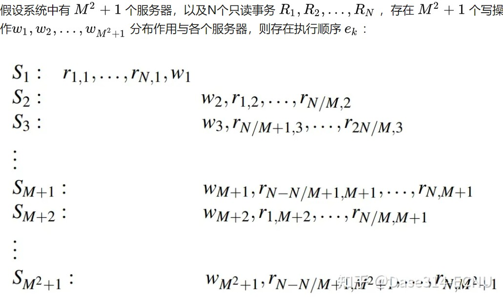

<!-- TOC -->
本文提出了对于只读事务的NOCS理论，阐明了只读事务不能对于最优性能和最强一致性（即事务的隔离级别）兼而有之。  
文章首先提出NOCS定理（理论见解）以指导更好的系统设计，同时提出工程实现PORT，表明了其建模在实际应用中的价值。  
- [背景](#背景)
- [读事务的最优性能（performance-optimal）](#读事务的最优性能performance-optimal)
    - [读事务性能的影响因素](#读事务性能的影响因素)
    - [NOC属性](#noc属性)
- [NOCS定理](#nocs定理)
    - [NOCS定理的证明](#证明)
    - [可能的属性结合](#可能的属性结合)
    - [NOCS定理的理论见解](#nocs定理的理论见解)
<!-- /TOC -->

# 背景
只读事务在应用实际负载中占据很大比重，同时对只读事务的研究在理论上也很重要，因为其为其他类型事务提供了一个下限：倘若某件事对于只读事务来说不可能达到，则其对于其它包含读操作的事务类型来说也不可能达到。  

读事务在负载中的占比使得其性能成为用户延迟和系统总体吞吐量的重要决定因素。但事务一致性的要求使得事务的多个读操作需要获取到一致视图，这使得其比简单的非事务性读操作性能要差。更强的一致性提供了更接近单线程环境的抽象，大大简化了应用程序的开发。因此理想的只读事务算法将提供最强的一致性和最优的性能。  

事务一致性：事务一致性通常由ACID特性（原子性、一致性、隔离性和持久性）来描述，其中一致性是指数据库必须在事务执行前后保持一致状态。也就是说，如果事务执行前数据库中的数据是一致的，那么事务执行后，数据库中的数据也应该是一致的。  

不同于SNOW中探索达到只读事务的最优延迟，该文章进一步提出只读事务的最优性能，其在延迟的基础上增加了吞吐的考虑，探索了一致性和性能间的折衷。  

文章采用简单读操作的属性引出只读事务的最优性能的定义。简单读操作满足三个属性，分别为  
1）O：一轮通讯（one round communication）  
2）N：非阻塞（non-blocking）  
3）C：常量元数据（constant amount of metadata）  
因此，只读事务的最优性能（performance-optimal）可定义为：在支持一致视图的情况下，满足NOC属性。  

# 读事务的最优性能（performance-optimal）
## 读事务性能的影响因素
读事务的性能受工程因素和算法属性两方面的影响。工程因素如负载均衡、批处理、网络传输等，其对于简单读操作和只读事务的影响是相同的，而算法属性如通讯轮数等仅存在于只读事务中，因此会对只读事务造成影响。因此，该文章将关注点集中在寻找只读事务算法属性所引入的开销。  

在现有系统协调一致视图的机制中，主要包括：阻塞、额外消息、额外元数据等，具体如下：  
阻塞：读操作被阻塞，直到一致的视图准备就绪，如采用两阶段锁，只有写事务提交释放写锁后，读操作才可执行  
额外消息：许多系统通过额外消息来决定一致视图，如读操作多轮通讯（on-path message），其代价直接作用于读操作；或者异步协调（off-path message），通常是将代价转移到写上，如COPS-SNOW等  
额外元数据：许多系统使用元数据来帮助计算只读事务所需的一致视图，如时间戳、事务ID等  

这些协调机制会消耗额外的系统资源，使得只读事务性能受损。该文章通过减少协调机制，使得只读事务性能接近于简单读取。  
## NOC属性
N：非阻塞（Non-blocking） 读请求的处理不必等待任何外部事件，如锁、消息等待、计时器超时等。阻塞读操作在增加只读事务延迟的同时，引入了上下文切换开销，也对吞吐产生了影响。而实际上，阻塞还会带来更严重的性能问题，如CPU利用率不足和死锁等，这在现代服务中越来越明显。  
O：单轮通讯（one-round communication）读事务仅可并行发起一轮通讯，且不允许额外的异步通讯。这避免了多轮读取（on-path message），也避免了异步协调（off-path message）。off-path message意味着删除该消息会对只读事务正确性造成影响，如COPOS-SNOW中在写入时引入了额外消息。off-path message虽不直接对只读事务造成影响，但会消耗网络和CPU资源，间接地影响系统性能。  
C：常量元数据（constant metadata） 元数据指协调一致视图所需的信息，通常服务器需要通过这些信息找到一个特定版本，以满足跨分区的一致视图。这些信息包括：时间戳、事务ID、所有参与者的服务器标识符等。常量元数据意味着读请求所需的元数据量不随节点增加、事务增大、并发操作增加而增加。传输额外的元信息会消耗网络和CPU资源，导致读事务延迟增加、吞吐降低。  

该文章关于性能最优（performance optimal）的定义如下：如果一个只读事务算法满足了N+O+C，则可被认为是性能最优的，因为其所引入的开销最少，从而使得性能尽可能地接近简单写操作。

# NOCS定理
一个理想的系统在达到性能最优的同时，也应提供最强的一致性，即在满足N+O+C的同时满足S属性（严格可串行化），NOCS定理证明了这个理想是不可能的，只读事务算法不可能同时达到性能最优和严格可串行化。  
## 证明
unstable region：与只读事务并发执行的写所占据的区域，该区域内事务的全序（total order）还未确定，可能存在冲突  
stable region：写已完成提交，且已完成排序。该区域内只读事务不会与写产生冲突  

NOCS定理的简要证明如下，其采用了反证法进行证明：  
前提条件 ：  
  
假设该系统没有元数据，即没有用于在请求间协调一致性的信息。  

Lemma 1 ：Without metadata, a read-only transaction that is N+O+S must observe any write that precedes it at a server （在没有元数据情况下，满足N+O+S的只读事务必须在该服务器上看到其前边的所有写操作）  
S属性的real-time order约束要求满足N+O的只读事务必须与unstable region内最近的写操作交互，以满足最新性（recency），因此 r1 和 r2 必须和 w1 和 w2 交互，以决定是否读到最新写入。  

Lemma 2 ：Processing e1 while satisfying N+O+S requires dependency R -> w1 to be transferred from S1 to S2（在满足N+O+S情况下处理执行顺序 e1 ， S1 需要将 R -> w1 的关系传递到 S2  
S属性的total order要求事务满足隔离性，因此不能读到写事务的部分结果，则必须在服务器间传递操作的顺序关系，以使得在 S2 上的读操作 r2 不能读到 w2 的结果。这意味着要满足S，必须有元信息传递。  

## 可能的属性结合
尽管NOCS属性不能同时被满足，但其中三个属性的组合是可能的。

O+C+S：阻塞只读事务，如Spanner。

N+C+S：多轮通讯协调出一致视图，如DrTM，RIFL。

N+O+S：通过额外的元数据进行事务排序，该组合尚未有现有系统实现

N+O+C：提供较弱一致性，如Spanner的快照读API提供的是可串行化，MySQL Cluster提供的是读可提交
## NOCS定理的理论见解
类似于CAP和SNOW定理，帮助系统设计者避免尝试不可能的设计目标，指导其在最优性能的只读事务和提供严格可串行化间做出选择。  

该文章最终实现了PORT，其提供了比严格可串行化稍弱的进程有序可串行化（POS, process-ordered serializability，详细描述在上一篇关于SNOW的分享中可见），但其仅支持简单的写操作，不支持写事务（即不满足SNOW中的W属性）。文章认为，在支持写事务且达到只读事务性能最优情况下（满足N+O+C+W属性），只读事务所能达到的最强一致性为因果一致性。  

1）为到达性能最优，N+O+C属性需要被满足，这要求系统不能使用基于验证的策略（中止并重试违反属性O），不能使用分布式锁（造成阻塞违反属性N），且处理读的复杂度不依赖于竞争情况（以满足属性C）。  

2）NOCS定理提供了一条实现性能最优（N+O+C）的途径：即使得读操作不发生在unstable region。为实现该途径，引出了两种技术：  
1. 显式排序控制：对于在unstable region中的读，将其重排序在所有未完成的写操作前。这显然违背real-time order，因此不满足严格可串行化，但在POS一致性下是允许的。
2. 多版本：多版本允许读操作控制其所需的版本，提供高效读。
该文章所提出的PORT设计方案将两个技术融合，在多版本存储上，通过版本时钟显式地调整顺序，使得读事务读到旧的稳定版本，以实现最优性能。

https://zhuanlan.zhihu.com/p/447637881

# 《AB-tree: index for concurrent random sampling and updates》

主要介绍了一种新的索引结构——AB-tree，它可以同时支持并发随机采样和更新操作。

文章首先介绍了现有索引结构在并发随机采样和更新操作时的局限性，然后提出了AB-tree索引结构。AB-tree将数据存储在一组连续的块中，并将每个块分成两个部分：A部分用于支持随机采样操作，B部分用于支持更新操作。通过这种方式，AB-tree可以同时支持并发的随机采样和更新操作，提高了系统的并发性能和可扩展性。

