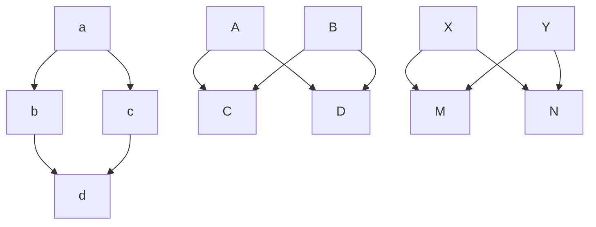
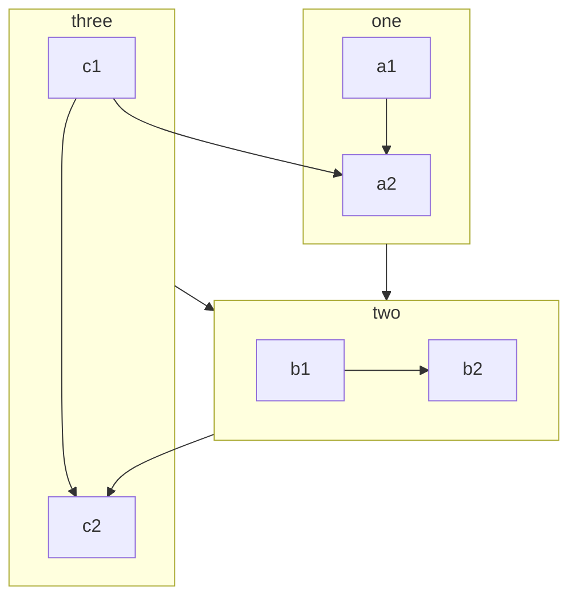

```mermaid
graph 
   a --> b & c--> d
   
   A & B--> C & D
   
    X --> M
    X --> N
    Y --> M
    Y --> N
```

```mermaid
flowchart TB
    c1-->a2
    subgraph one
    a1-->a2
    end
    subgraph two
    b1-->b2
    end
    subgraph three
    c1-->c2
    end
    one --> two
    three --> two
    two --> c2
```